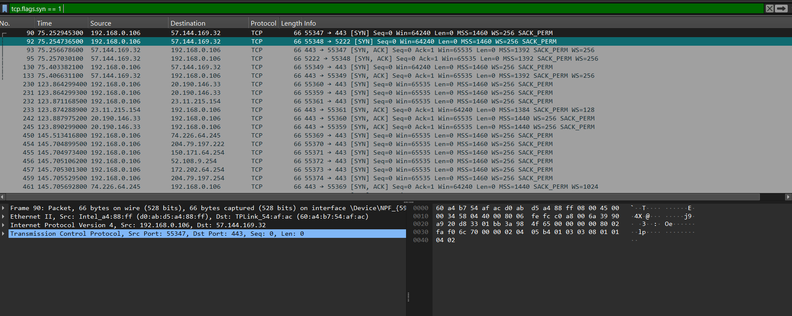

# Project 3 - Suspicious Network Traffic Analysis Using Wireshark & Splunk

## Objective
Capture and analyze network traffic using Wireshark to identify suspicious activity and correlate logs using Splunk.

---

## Tools Used
- Wireshark (Packet Capture & Analysis)
- Splunk Enterprise (Log Correlation & Monitoring)
- Windows PowerShell (Port Scan Simulation)

---

## Wireshark Filters Used

```wireshark
dns
http
tcp.flags.syn == 1
ip.addr == [Target IP]
---

## Purpose of Filters
- `dns` → Analyze DNS traffic
- `http` → Monitor HTTP traffic
- `tcp.flags.syn == 1` → Detect SYN packets used during port scanning
- `ip.addr == [Target IP]` → Filter traffic for a specific target system

---

## Attack Simulation
Simulated TCP SYN port scanning activity using PowerShell `Test-NetConnection` to generate suspicious traffic patterns for analysis.

Captured network packets in Wireshark and identified repeated SYN requests indicating scanning behavior.

---

## Findings
- Observed multiple SYN packets targeting different ports
- Identified suspicious connection attempts
- Verified abnormal traffic behavior using Wireshark packet analysis
- Exported packet capture (PCAP) file for further investigation

---

## Splunk Correlation
Imported captured logs into Splunk Enterprise to correlate network events and monitor suspicious traffic activity.

---

## Outcome
Successfully detected and analyzed simulated port scan activity using Wireshark and Splunk.

This project improved understanding of:
- Network Traffic Analysis
- Packet Inspection
- Threat Detection
- SIEM Monitoring
- Basic Incident Investigation

---

## Skills Demonstrated
- Packet Analysis
- Threat Detection
- TCP/IP Fundamentals
- Network Monitoring
- SIEM Log Correlation
- Incident Investigation Basics

---

## Screenshots

### SYN Packet Detection in Wireshark

